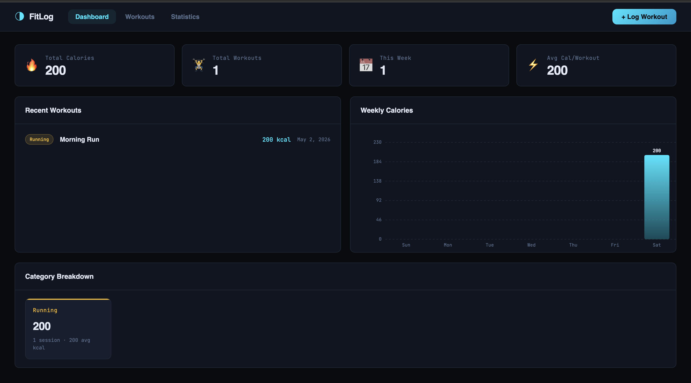

# 🏋️ Fitness Tracker

A responsive web application to track workouts, calories, and fitness progress with persistent storage.

---

## 🌐 Live Demo
👉 https://govindmishra2006.github.io/fitness-tracker/

---

## 🚀 Features

- Add workouts with name and calories  
- Track workout history  
- Persistent storage using localStorage  
- Clean and responsive UI  
- Dynamic updates without page reload  

---

## 🛠️ Tech Stack

- HTML  
- CSS  
- JavaScript  

---

## 📸 Preview

---

## 📂 Project Structure

fitness-tracker/
│── index.html  
│── style.css  
│── app.js  

---

## ▶️ How to Run

1. Clone repo: git clone https://github.com/govindmishra2006/fitness-tracker.git
2. Open folder and run:
- Open `index.html` in browser  

---

## 👨‍💻 Author

Govind Gopal Mishra 
